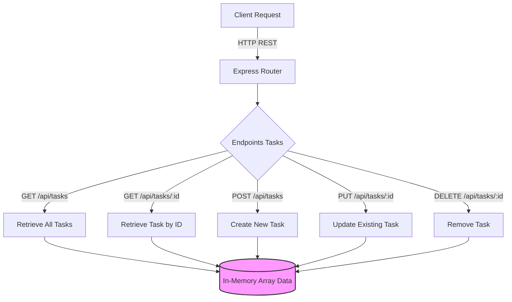

# Tugas 1 Praktikum PPL - Task Manager API

Sebuah RESTful API sederhana yang dibangun dengan Node.js dan Express untuk mengelola daftar tugas (to-do list). Proyek ini dilengkapi dengan unit testing menggunakan Jest dan Supertest, serta telah dikontainerisasi menggunakan Docker dan Docker Compose.


## Arsitektur Aplikasi



## Prasyarat

- Node.js (v22 mereferensikan konfigurasi Dockerfile)
- Docker
- Docker Compose

## Panduan Instalasi & Menjalankan Aplikasi

### Pengembangan Lokal (Local Development)

1. Kloning repositori:
   ```bash
   git clone https://github.com/ikanhiusukamakanikan/Tugas1PraktikumPPL.git
   cd Tugas1PraktikumPPL
   ```

2. Instal dependensi dari `package.json`:
   ```bash
   npm install
   ```

3. Jalankan aplikasi:
   - Mode standar: `npm start`
   - Mode pengembangan (auto-reload): `npm run dev`

Aplikasi akan berjalan di port `3000`.

### Menggunakan Docker

Bangun dan jalankan kontainer aplikasi dari direktori utama proyek:
```bash
docker-compose up --build
```
Aplikasi API lokal akan dapat diakses melalui `http://localhost:3000`.

## Dokumentasi Endpoint API

Base URL untuk lokal: `http://localhost:3000`

### 1. Ambil Semua Daftar Tugas
- **URL**: `/api/tasks`
- **Metode**: `GET`
- **Response Berhasil**: `200 OK` (Berisi array semua task)

### 2. Ambil Spesifik Tugas Berdasarkan ID
- **URL**: `/api/tasks/:id`
- **Metode**: `GET`
- **Response Berhasil**: `200 OK`
- **Response Gagal**: `404 Not Found` (Apabila ID tidak ditemukan)

### 3. Buat Tugas Baru
- **URL**: `/api/tasks`
- **Metode**: `POST`
- **Body Requirement**: 
  ```json
  {
    "title": "Nama Tugas Anda"
  }
  ```
- **Response Berhasil**: `200 OK`
- **Response Gagal**: `400 Bad Request` (Jika field "title" tidak disertakan)

### 4. Perbarui Tugas yang Sudah Ada
- **URL**: `/api/tasks/:id`
- **Metode**: `PUT`
- **Body** (Field Opsional):
  ```json
  {
    "title": "Nama Tugas Diperbarui",
    "completed": true
  }
  ```
- **Response Berhasil**: `200 OK`
- **Response Gagal**: `404 Not Found`

### 5. Hapus Sebuah Tugas
- **URL**: `/api/tasks/:id`
- **Metode**: `DELETE`
- **Response Berhasil**: `200 OK`
- **Response Gagal**: `404 Not Found`

## Pengujian (Testing)

Proyek ini telah melalui pengujian API dengan framework Jest dan Supertest. Untuk menjalankan rangkaian uji unit:
```bash
npm test
```
Tes mencakup pengujian respons positif untuk keseluruhan skenario CRUD, serta validasi deteksi error (seperti kode `404 Not Found` dan kode `400 Bad Request`) memastikan stabilitas endpoint API.